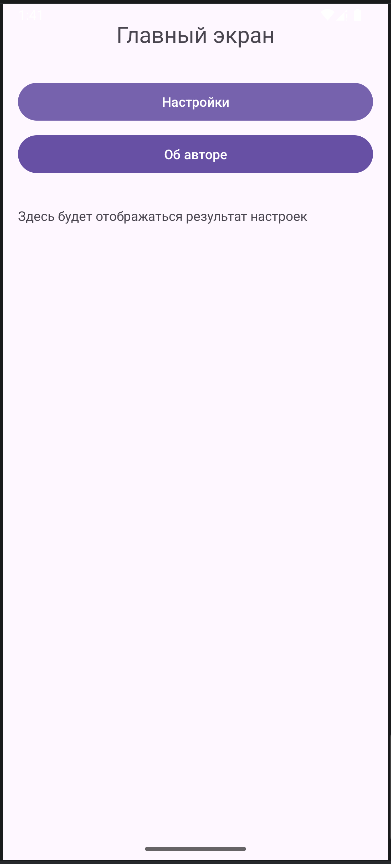
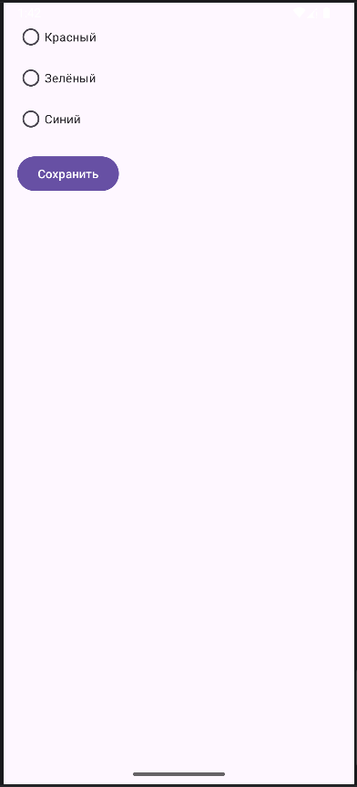
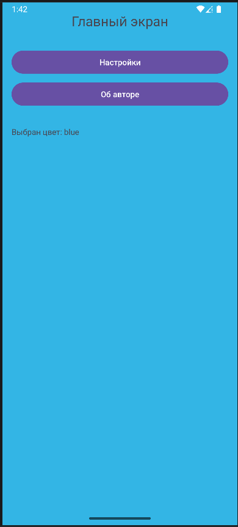
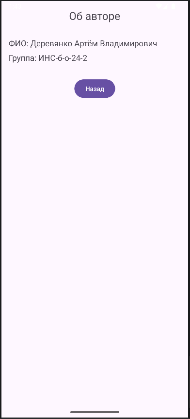

<div align="center">

# Отчёт

</div>

<div align="center">

## Практическая работа №5

</div>

<div align="center">

## Работа с несколькими окнами (Activity)

</div>

**Выполнил:** Деревянко Артём Владимирович<br>
**Курс:** 2<br>
**Группа:** ИНС-б-о-24-2<br>
**Направление:** 09.03.02 Информационные системы и технологии<br>
**Проверил:** Потапов Иван Романович

---

### Цель работы
Научиться создавать многоэкранные приложения, осуществлять навигацию между активностями (Activity) и передавать данные между ними с использованием объектов Intent и механизма startActivityForResult / onActivityResult.

### Ход работы
#### Задание 1: Создание главной Activity
  1. Был открыт Android Studio и создан новый проект с шаблоном **Empty Views Activity**. Проекту дано имя `MultiWindowLab`.
  2. В файле `activity_main.xml` создан интерфейс с двумя кнопками: "Настройки" и "Об авторе", а также добавлен элемент (например, TextView или ImageView), который будет изменяться в зависимости от выбранных настроек.
  ##### Код для `activity_main.xml`
  ```xml
  <?xml version="1.0" encoding="utf-8"?>
    <LinearLayout xmlns:android="http://schemas.android.com/apk/res/android"
        android:id="@+id/main"
        android:layout_width="match_parent"
        android:layout_height="match_parent"
        android:orientation="vertical"
        android:padding="16dp">

        <TextView
            android:id="@+id/tvMain"
            android:layout_width="wrap_content"
            android:layout_height="wrap_content"
            android:text="Главный экран"
            android:textSize="24sp"
            android:layout_gravity="center_horizontal"
            android:layout_marginBottom="32dp"/>

        <Button
            android:id="@+id/btnSettings"
            android:layout_width="match_parent"
            android:layout_height="wrap_content"
            android:text="Настройки"/>

        <Button
            android:id="@+id/btnAbout"
            android:layout_width="match_parent"
            android:layout_height="wrap_content"
            android:text="Об авторе"
            android:layout_marginTop="8dp"/>

        <TextView
            android:id="@+id/tvResult"
            android:layout_width="wrap_content"
            android:layout_height="wrap_content"
            android:text="Здесь будет отображаться результат настроек"
            android:layout_marginTop="32dp"/>

    </LinearLayout>
  ```

#### Задание 2: Создание Activity "Настройки" (SettingsActivity)
Согласно способу 2:
1. Создан XML-файл разметки `res/layout/activity_settings.xml`.
2. Создан Java-класс `SettingsActivity`, который унаследован от `AppCompatActivity` и переопределён метод `onCreate`, указав `setContentView(R.layout.activity_settings);`.
3. Зарегистрирована Activity в `AndroidManifest.xml`.
##### Код для `activity_settings.xml`
```xml
<?xml version="1.0" encoding="utf-8"?>
<LinearLayout xmlns:android="http://schemas.android.com/apk/res/android"
    android:layout_width="match_parent"
    android:layout_height="match_parent"
    android:orientation="vertical"
    android:padding="16dp">

    <RadioGroup
        android:id="@+id/radioGroupColor"
        android:layout_width="wrap_content"
        android:layout_height="wrap_content"
        android:layout_marginBottom="16dp">

        <RadioButton
            android:id="@+id/radioRed"
            android:layout_width="wrap_content"
            android:layout_height="wrap_content"
            android:text="Красный"/>

        <RadioButton
            android:id="@+id/radioGreen"
            android:layout_width="wrap_content"
            android:layout_height="wrap_content"
            android:text="Зелёный"/>

        <RadioButton
            android:id="@+id/radioBlue"
            android:layout_width="wrap_content"
            android:layout_height="wrap_content"
            android:text="Синий"/>
    </RadioGroup>

    <Button
        android:id="@+id/btnSave"
        android:layout_width="wrap_content"
        android:layout_height="wrap_content"
        android:text="Сохранить"/>

</LinearLayout>
```
##### Код для `SettingsActivity.java`
```java
package com.example.multiwindowlab;

import android.content.Intent;
import android.os.Bundle;
import android.view.View;
import android.widget.Button;
import android.widget.RadioButton;
import android.widget.RadioGroup;
import androidx.appcompat.app.AppCompatActivity;

public class SettingsActivity extends AppCompatActivity {

    private RadioGroup radioGroupColor;
    private Button btnSave;

    @Override
    protected void onCreate(Bundle savedInstanceState) {
        super.onCreate(savedInstanceState);
        setContentView(R.layout.activity_settings);

        radioGroupColor = findViewById(R.id.radioGroupColor);
        btnSave = findViewById(R.id.btnSave);

        btnSave.setOnClickListener(new View.OnClickListener() {
            @Override
            public void onClick(View v) {
                int selectedId = radioGroupColor.getCheckedRadioButtonId();
                String selectedColor = "red"; // по умолчанию

                if (selectedId == R.id.radioGreen) {
                    selectedColor = "green";
                } else if (selectedId == R.id.radioBlue) {
                    selectedColor = "blue";
                }

                Intent resultIntent = new Intent();
                resultIntent.putExtra("COLOR", selectedColor);
                setResult(RESULT_OK, resultIntent);
                finish(); // закрываем SettingsActivity и возвращаемся к MainActivity
            }
        });
    }
}
```

#### Задание 3: Создание Activity "Об авторе" (AboutActivity)
Аналогично создана `AboutActivity` с простой информацией об авторе (ФИО, группа, возможно фото). В этой Activity не требуется возвращать результат, поэтому используйте обычный `startActivity()`.
##### Разметка `activity_about.xml`
```xml
<?xml version="1.0" encoding="utf-8"?>
<LinearLayout xmlns:android="http://schemas.android.com/apk/res/android"
    android:layout_width="match_parent"
    android:layout_height="match_parent"
    android:orientation="vertical"
    android:padding="16dp">

    <TextView
        android:layout_width="wrap_content"
        android:layout_height="wrap_content"
        android:text="Об авторе"
        android:textSize="24sp"
        android:layout_gravity="center_horizontal"
        android:layout_marginBottom="32dp"/>

    <TextView
        android:layout_width="wrap_content"
        android:layout_height="wrap_content"
        android:text="ФИО: Деревянко Артм Владимирович"
        android:textSize="18sp"/>

    <TextView
        android:layout_width="wrap_content"
        android:layout_height="wrap_content"
        android:text="Группа: ИНС-б-о-24-2"
        android:textSize="18sp"
        android:layout_marginTop="8dp"/>

    <!-- Можно добавить ImageView для фото -->

    <Button
        android:id="@+id/btnBack"
        android:layout_width="wrap_content"
        android:layout_height="wrap_content"
        android:text="Назад"
        android:layout_gravity="center_horizontal"
        android:layout_marginTop="32dp"/>

</LinearLayout>
```
##### Логика `AboutActivity.java`
```java
package com.example.multiwindowlab;

import android.os.Bundle;
import android.view.View;
import android.widget.Button;
import androidx.appcompat.app.AppCompatActivity;

public class AboutActivity extends AppCompatActivity {

    @Override
    protected void onCreate(Bundle savedInstanceState) {
        super.onCreate(savedInstanceState);
        setContentView(R.layout.activity_about);

        Button btnBack = findViewById(R.id.btnBack);
        btnBack.setOnClickListener(new View.OnClickListener() {
            @Override
            public void onClick(View v) {
                finish(); // просто закрываем Activity и возвращаемся к предыдущей
            }
        });
    }
}
```

#### Задание 4: Реализация навигации в MainActivity
В `MainActivity.java` добавлены обработчики для кнопок и реализовано получение результата из `SettingsActivity`.
##### Код для `MainActivity.java`
```java
package com.example.multiwindowlab;

import android.content.Intent;
import android.os.Bundle;
import android.view.View;
import android.widget.Button;
import android.widget.TextView;
import androidx.annotation.Nullable;
import androidx.appcompat.app.AppCompatActivity;

public class MainActivity extends AppCompatActivity {

    private static final int REQUEST_CODE_SETTINGS = 1;
    private TextView tvResult;
    private View mainLayout;

    @Override
    protected void onCreate(Bundle savedInstanceState) {
        super.onCreate(savedInstanceState);
        setContentView(R.layout.activity_main);

        Button btnSettings = findViewById(R.id.btnSettings);
        Button btnAbout = findViewById(R.id.btnAbout);
        tvResult = findViewById(R.id.tvResult);
        mainLayout = findViewById(R.id.main); // если задан id для корневого layout

        btnSettings.setOnClickListener(new View.OnClickListener() {
            @Override
            public void onClick(View v) {
                Intent intent = new Intent(MainActivity.this, SettingsActivity.class);
                startActivityForResult(intent, REQUEST_CODE_SETTINGS);
            }
        });

        btnAbout.setOnClickListener(new View.OnClickListener() {
            @Override
            public void onClick(View v) {
                Intent intent = new Intent(MainActivity.this, AboutActivity.class);
                startActivity(intent);
            }
        });
    }

    @Override
    protected void onActivityResult(int requestCode, int resultCode, @Nullable Intent data) {
        super.onActivityResult(requestCode, resultCode, data);
        if (requestCode == REQUEST_CODE_SETTINGS) {
            if (resultCode == RESULT_OK && data != null) {
                String color = data.getStringExtra("COLOR");
                tvResult.setText("Выбран цвет: " + color);

                // Изменяем цвет фона в зависимости от выбранного цвета
                switch (color) {
                    case "red":
                        mainLayout.setBackgroundColor(getResources().getColor(android.R.color.holo_red_light));
                        break;
                    case "green":
                        mainLayout.setBackgroundColor(getResources().getColor(android.R.color.holo_green_light));
                        break;
                    case "blue":
                        mainLayout.setBackgroundColor(getResources().getColor(android.R.color.holo_blue_light));
                        break;
                }
            }
        }
    }
}
```
Приложение было запущено. При нажатии на кнопку "Настройки" текущая `MainActivity`сменяется на `SettingsActivity`. Аналогичное поведение при нажатии на кнопку "Об авторе". В открытой `SettingsActivity` есть возможность изменить цвет фона для `MainActivity`, а в `AboutActivity` можно посмотреть имя автора.<br>
<br>
<br>
<br>
<br>

#### Задания для самостоятельного выполнения
Необходимо реализовать приложение с двумя дополнительными активностями: экран настроек и экран "Об авторе". На главном экране должно отображаться применение настроек.<br>
**Вариант 11 (1):** Изменение цвета фона на главной странице (не менее 3 цветов на выбор).<br>

### Вывод
В результате выполнения практической работы были получены навыки создания многоэкранных приложений, осуществления навигации между активностями (Activity) и передавать данные между ними с использованием объектов Intent и механизма startActivityForResult / onActivityResult.

### Ответы на контрольные вопросы
1. **Что такое `Intent`? Какие существуют типы Intent (явные и неявные)? Приведите примеры использования каждого типа.**<br>
`Intent` — это объект, описывающий намерение выполнить операцию (запуск Activity, сервиса, доставку сообщения).<br>
**Явный Intent** — точно указывает класс компонента:
```java
Intent intent = new Intent(MainActivity.this, SettingsActivity.class);
startActivity(intent);
```
**Неявный Intent** — описывает действие, система подбирает компонент:
```java
Intent intent = new Intent(Intent.ACTION_VIEW, 
    Uri.parse("https://google.com"));
startActivity(intent);
```

2. **Как передать данные из одной Activity в другую с помощью Intent? Какие ограничения на типы передаваемых данных существуют?**<br>
Передача через `putExtra()`:
```java
intent.putExtra("KEY_NAME", "value");
intent.putExtra("KEY_AGE", 25);
```
Получение через `getExtra()`:
```java
String name = getIntent().getStringExtra("KEY_NAME");
int age = getIntent().getIntExtra("KEY_AGE", 0);
```
**Ограничения:** передаются только примитивные типы, `String`, объекты реализующие `Serializable` или `Parcelable`.

3. **В чем разница между методами `startActivity()` и `startActivityForResult()`? В каких случаях используется каждый из них?**<br>
`startActivity()` — запускает Activity **без ожидания результата**.<br>
`startActivityForResult()` — запускает Activity **с ожиданием результата** (возврат данных через `onActivityResult()`).<br>
**Используется:** `startActivityForResult()` когда нужно получить данные из запущенной Activity (например, выбор настроек).<br>

4. **Опишите назначение методов `setResult()` и `finish()` в контексте возврата данных из дочерней Activity.**<br>
`setResult(resultCode, intent)` — устанавливает результат для возврата родительской Activity (`RESULT_OK` или `RESULT_CANCELED`).<br>
`finish()` — закрывает текущую Activity и возвращает управление предыдущей.<br>
**Пример:**
```java
Intent result = new Intent();
result.putExtra("COLOR", "red");
setResult(RESULT_OK, result);
finish();
```

5. **Что произойдёт, если не зарегистрировать Activity в файле `AndroidManifest.xml`?**<br>
Приложение **аварийно завершится** с ошибкой `ActivityNotFoundException` при попытке запустить незарегистрированную Activity.

6. **Какие методы жизненного цикла Activity вызываются при переходе от `MainActivity` к `SettingsActivity` и при возврате обратно?**<br>
**При переходе в SettingsActivity:**
- MainActivity: `onPause()` → `onStop()`
- SettingsActivity: `onCreate()` → `onStart()` → `onResume()`
**При возврате в MainActivity:**
- SettingsActivity: `onPause()` → `onStop()` → `onDestroy()`
- MainActivity: `onRestart()` → `onStart()` → `onResume()`

7. **Для чего используется `requestCode` в методе `startActivityForResult()`? Как обрабатываются несколько различных запросов в `onActivityResult()`?**<br>
`requestCode` — **уникальный идентификатор** запроса, позволяет определить, из какой Activity пришёл результат.<br>
**Обработка:**
```java
static final int REQUEST_SETTINGS = 1;
static final int REQUEST_PICKER = 2;

startActivityForResult(intent1, REQUEST_SETTINGS);
startActivityForResult(intent2, REQUEST_PICKER);

@Override
protected void onActivityResult(int requestCode, int resultCode, Intent data) {
    if (requestCode == REQUEST_SETTINGS) {
        // обработка результата из SettingsActivity
    } else if (requestCode == REQUEST_PICKER) {
        // обработка результата из PickerActivity
    }
}
```